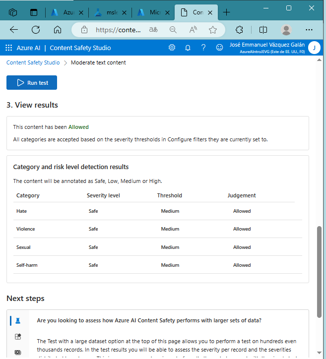
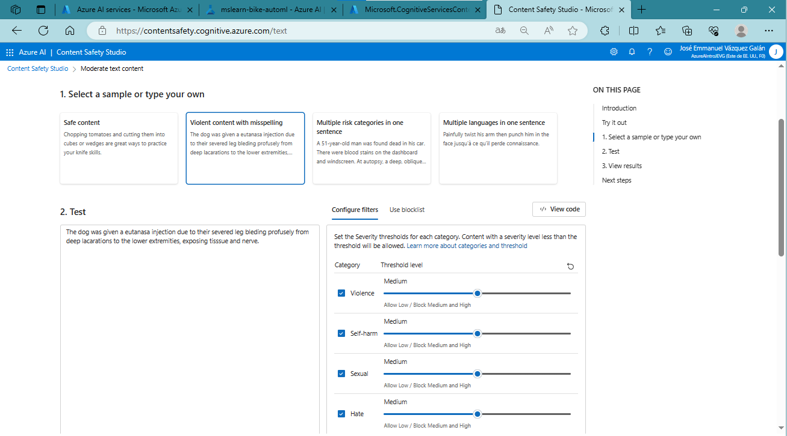
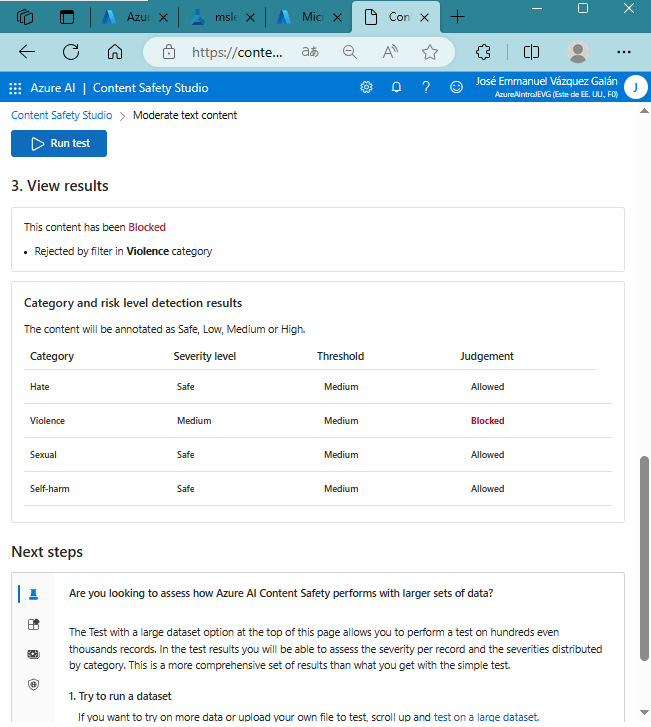

# Exploring Azure Artificial Intelligence Services

Azure AI services help users build AI applications with out-of-the-box, precompiled, customizable APIs and models. In this exercise, you'll take a look at one of the services, Azure AI Content Safety, in Content Safety Studio.

Content Safety Studio allows you to explore how text and image content can be moderated. You can run tests on sample text or images and get a severity score ranging from safe to high for each category. In this lab exercise, you will create a single service resource in Content Safety Studio and test its functionalities.

**Note** The goal of this exercise is to get a general idea of how Azure AI services are provisioned and used. Content security is used as an example, but you are not expected to gain a complete understanding of content security in this exercise.

## Associating a resource with the study

Before using the study, you must associate an Azure AI services resource with the study. Depending on the studio, you may need a specific single service resource or you may be able to use a general multi-service resource. In the case of Content Safety Studio, you can use the service by creating a single service content safety resource or a general Azure AI Services multi-service resource. In the steps below, we will create a single-service content safety resource.

            

 
<em><strong> 
Initial setup for Content Safety Studio.
</em></strong>  
 

At the top right of the screen, click on the Settings icon.

            

 
<em><strong> 
Settings icon on Content Safety Studio.
</em></strong> 
 

On the Create Content Security in Azure Portal page, you must configure several details to create the resource. Configure it with the following settings: Subscription: your Azure subscription. Resource Group: select or create a resource group with a unique name. Region: choose any available region. Name: type a unique name. Rate plan: Free F0

            

 
<em><strong> 
Resource creation settings.
</em></strong>  

Select Review + Create and review the settings. Then select Create. The screen will indicate when the implementation is complete. Congratulations! You have just created or provisioned an Azure AI services resource. The one you provisioned in particular is a single-service content security service resource.

            

 <em><strong> 
Confirmation of resource creation.</em></strong> 
 

When the deployment is complete, open a new tab and return to Content Safety Studio.

            

 <em><strong>Navigation back to Content Safety Studio.</strong></em> 

Select the Settings icon at the top right of the screen again. This time, you should see that the newly created resource has been added to the list.

On the Content Safety Studio Configuration page, select the Azure AI service resource you just created and click Use resource at the bottom of the screen. You will return to the studio's home page. You can now start using the studio with the newly created resource.

            

 <em><strong>Selecting the newly created resource for use.</strong></em> 

## Test text moderation in Content Safety Studio

On the Content Safety Studio home page, under Run moderation tests, go to the Moderate text content box and click Test it.

            

 <em><strong>Moderate text content test initiation.</strong></em> 

Under Run a simple test, click Content Safe. Notice that the text is displayed in the box below.

            

 <em><strong>Preparation for a simple test of content safety.</strong></em> 

Click Run Test. When running a test, the deep learning model of the content security service is called. The deep learning model has already been trained to recognize unsecured content.

            

 <em><strong>Running the content safety test.</strong></em> 

In the Results pane, inspect the results. There are four severity levels, from safe to high, and four types of harmful content. Does the Content Safety AI service find this sample acceptable or not? What is important to keep in mind is that the results are within a confidence interval. A well-trained model, such as one of Azure AI's out-of-the-box models, can return results that have a high probability of matching what a human would label as a result. Each time a test is run, the model is called again.

            

 <em><strong>Results pane showing test outcomes.</strong></em> 

Now try another sample. Select the text in Violent content with misspellings. Check that the content is displayed in the box below.

            

 <em><strong>Selecting a new sample for testing.</strong></em> 

Click Run Test and inspect the results again in the Results pane.

            

 <em><strong>Inspecting the results of the second test.</strong></em> 

You can run tests on all provided samples and then inspect the results.

## Take a look at the keys and the connection point

These capabilities you tested can be programmed in all types of applications. The keys and connection point used for application development can be found in both Content Safety Studio and Azure Portal.

In Content Safety Studio, return to the Configuration page, with the Resources tab selected. Find the resource you used. Scroll here to see the resource's connection point and key.

            

 <em><strong>Finding the resource's connection point and key in Content Safety Studio.</strong></em> 

In the Azure Portal, you will see that this is the same connection point and different keys for the resource. To check this, go to the Azure Portal. Search for Content Security in the top search bar. Find your resource and click on it. In the left menu, look under Resource Management for keys and logon points. Select Keys and Connection Points to view the resource's connection point and keys.

            

 <em><strong>Azure portal view of keys and connection points.</strong></em> 

**NOTE:** Once you are finished, you can delete the content security resource from the Azure Portal. Removing the resource is a way to reduce the costs that accrue when the resource exists in the subscription. To do this, go to the Content Security Resource Overview page. Select Delete at the top of the screen.

  
🌟 Did you find any repository useful?

  If any project has been helpful to you, consider giving it a ⭐ star in the repository and follow my GitHub account to stay tuned for future updates! 🚀

  In addition, I am always open to suggestions, recommendations or collaborations. Feel free to [get in touch](https://www.linkedin.com/in/vazquez-galan-jose-emmanuel-664968221) if you have any questions or ideas for improving this project. I'm excited for your feedback and contributions.

  Thank you for your interest and support! 😊

 This work is licensed under a <a rel="license" href="http://creativecommons.org/licenses/by-nc-sa/4.0/">Creative Commons Attribution-NonCommercial-ShareAlike 4.0 International License</a>.

