# Exploring Automated Machine Learning in Azure Machine Learning

In this exercise, you will use the automated machine learning feature of Azure Machine Learning to train and evaluate a machine learning model. You will then implement and test the trained model.

## Creating an Azure Machine Learning Workspace

To use Azure Machine Learning, you must provision an Azure Machine Learning workspace in your Azure subscription. You can then use Azure Machine Learning Studio to work with the resources in the workspace.

**Tip:** If you already have an Azure Machine Learning workspace, you can use it and move on to the next task.

Sign in to Azure Portal with your Microsoft credentials at [https://portal.azure.com](https://portal.azure.com)

            

 <em><strong>Create a new resource into Azure Portal.</strong></em> 

            

 <em><strong>Example of Azure Portal browser and dashboard.</strong></em> 

            

 <em><strong>Azure services overview.</strong></em> 

Select + Create a resource, search for Machine Learning and create a new Azure Machine Learning resource with the following settings:
- Subscription: your Azure subscription.
- Resource Group: create or select a resource group.

            

 <em><strong>Creating a new Azure Machine Learning resource.</strong></em> 

- Name: type a unique name for the workspace.
- Region: select the nearest geographical region.
- Storage account: note the new default storage account to be created for the workspace.
- Keystore: note the new default keystore that will be created for the workspace.
- Application Insights: Note the new default Application Insights resource that will be created for the workspace.
- Container record: None (one will be created automatically the first time you deploy a model in a container).

            

 <em><strong>Configuring new Azure Machine Learning workspace settings.</strong></em> 

Select Review + create and then select Create. Wait for the workspace to be created (this may take a few minutes), and then go to the deployed resource.

Select Launch Studio (or open a new browser tab, go to [https://ml.azure.com](https://ml.azure.com) and sign in to Azure Machine Learning Studio with your Microsoft account). Close all messages that are displayed.

In Azure Machine Learning Studio, you should see the newly created workspace. If not, select All Workspaces from the menu on the left, and then select the workspace you just created.

            

 <em><strong>Azure Machine Learning Studio workspace.</strong></em> 

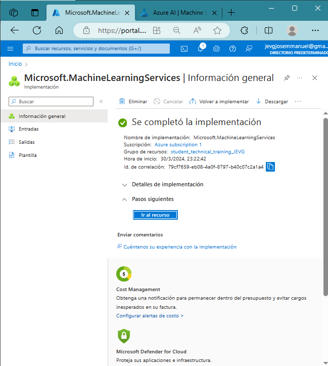

## Using automated machine learning to train a model

Automated machine learning allows you to test various algorithms and parameters to train several models and identify the best one for your data. In this exercise, you will use a dataset of historical bicycle rental details to train a model that predicts the number of bicycle rentals to expect on a given day, based on seasonal and weather characteristics.

Citation: The data used in this exercise is derived from Capital Bikeshare and used in accordance with the published data license agreement.

In Azure Machine Learning Studio, see the Automated Machine Learning page (under Creation).

            
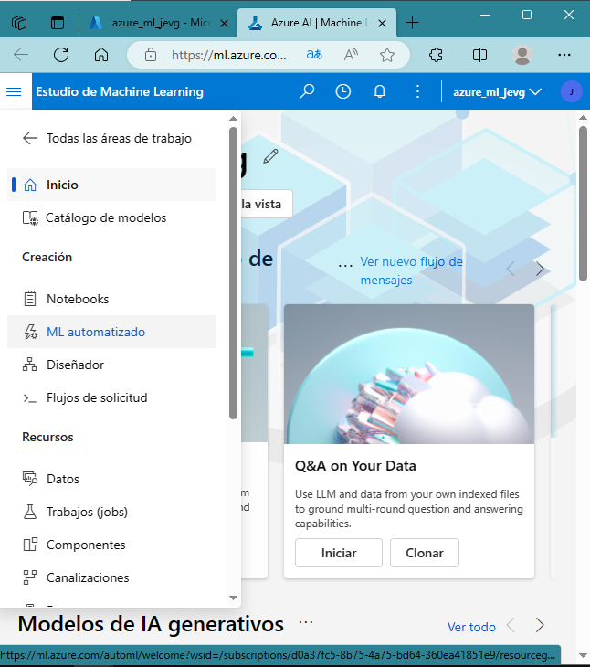
 <em><strong>Automated Machine Learning page overview.</strong></em> 

Create a new automated ML job with the following configuration, using Next as needed to progress through the user interface:

            
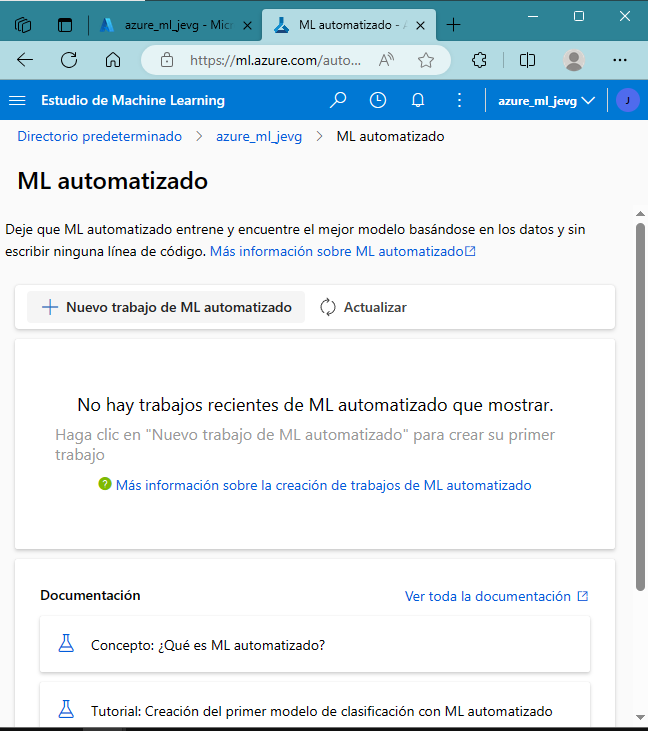
 <em><strong>Creating a new automated ML job.</strong></em> 

### Basic settings:

- Job name: mslearn-bike-automl
- New experiment name: mslearn-bike-rental
- Description: Automated machine learning for bike rental prediction.
- Tags: none

            
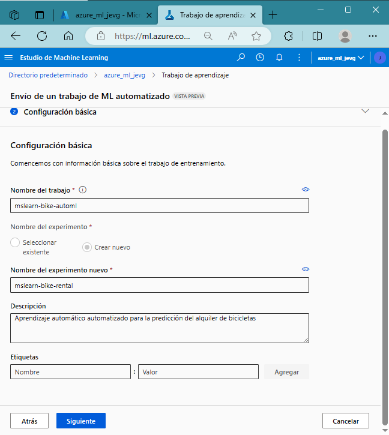
 <em><strong>Basic settings for the ML job.</strong></em> 

### Task and data type:

            
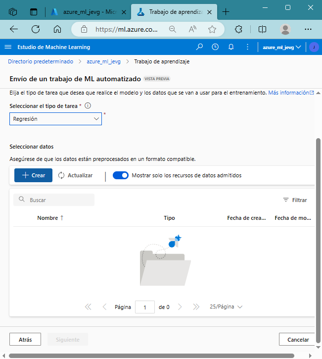
 <em><strong>Data set creation and selection.</strong></em> 

- Select task type: Regression
- Select data set: create a new data set with the following settings:
    - Data type:
    - Name: bicycle rental
    - Description: Bicycle rental historical data
    - Type: Tabular

            
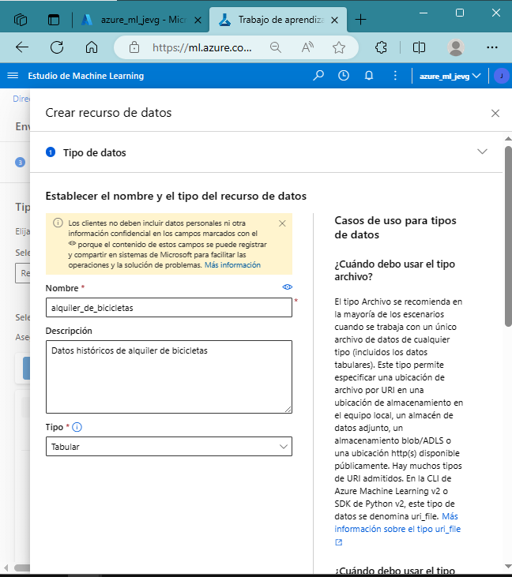
 <em><strong>Task and data type settings.</strong></em> 

### Data Source:

- Select from web archives

            
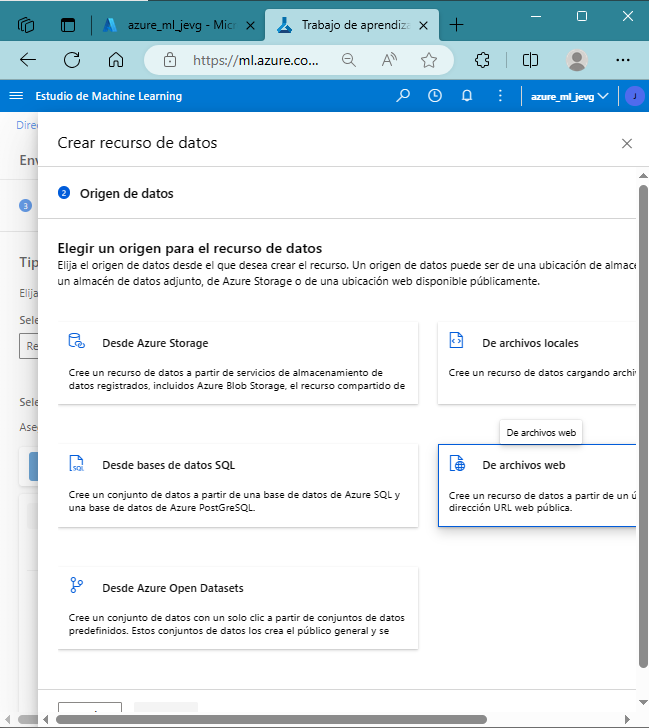
 <em><strong>Data source selection.</strong></em> 

- Web URL: `https://aka.ms/bike-rentals`
- Omit data validation: do not select

            
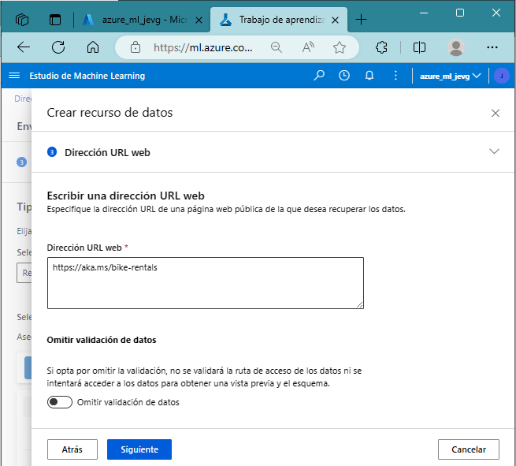
 <em><strong>Web URL configuration.</strong></em> 

### Settings:

- File format: Delimited
- Delimiter: Comma
- Encoding: UTF-8
- Column headers: only the first file has headers
- Skip rows: None
- Dataset contains multi-line data: do not select

            
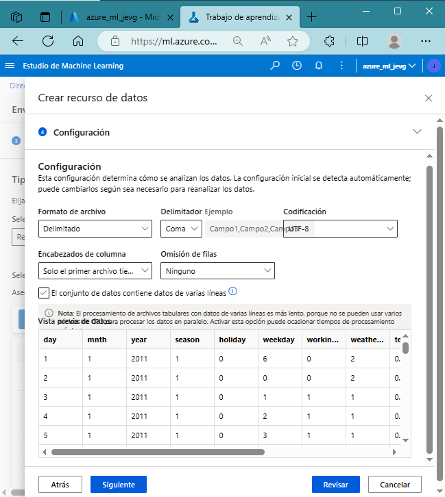
 <em><strong>Settings for data import.</strong></em> 

### Schema:

- Include all columns other than Path.
- Review automatically detected types

            
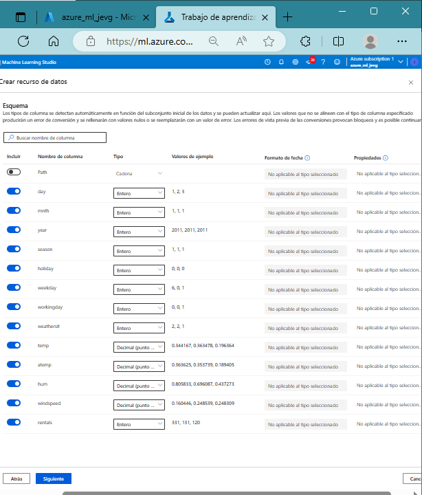
 <em><strong>Schema configuration and review.</strong></em> 

Select Create. Once the dataset is created, select the bike rental dataset to continue submitting the automated ML job.

            
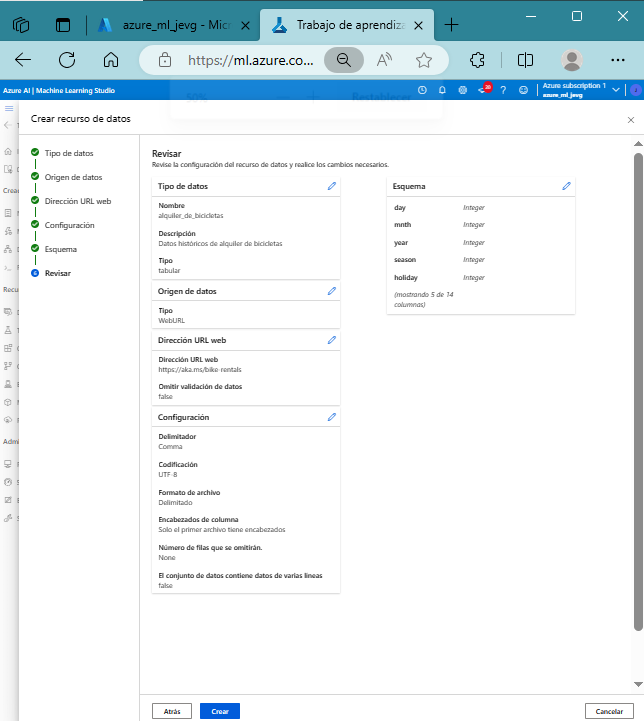
 <em><strong>Final step: Dataset creation confirmation.</strong></em> 

### Task Setup:

- Task type: regression
- Dataset: Bicycle Rental
- Target Column: Rentals (integer)
- Additional configuration settings

            
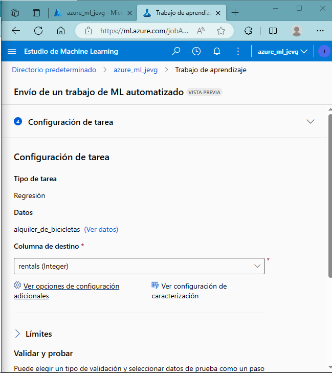
 <em><strong>Task setup for regression on Bicycle Rental dataset.</strong></em> 

Primary Metric: Normalized Mean Square Error
Explain best model: Not selected
Use all supported models: Unselected. Will restrict the job to test only a few specific algorithms.

            
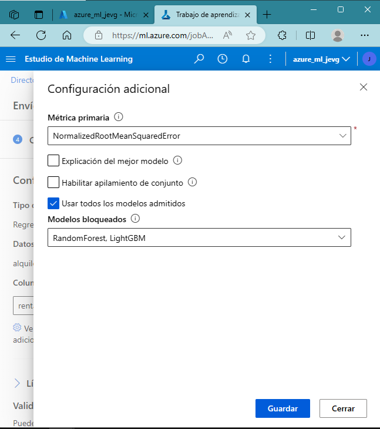
 <em><strong>Selection of models and primary metric.</strong></em> 

### Limits: Expand this section

- Maximum number of tests: 3
- Maximum number of simultaneous trials: 3
- Maximum number of nodes: 3
- Metric score threshold: 0.085

            
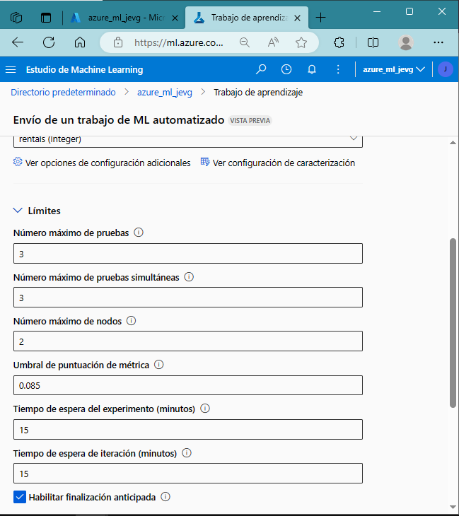
 <em><strong>Setting limits for the automated ML job.</strong></em> 

### Validation and testing:

- Validation type: training validation split.
- Percentage of validation data: 10
- Test data set: None

            
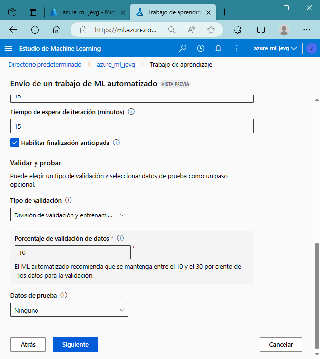
 <em><strong>Validation and testing setup.</strong></em> 

### Computation:

- Select process type: No server
- Virtual machine type: CPU
- Virtual machine level: Dedicated
- Virtual Machine size: Standard_DS3_V2*

            
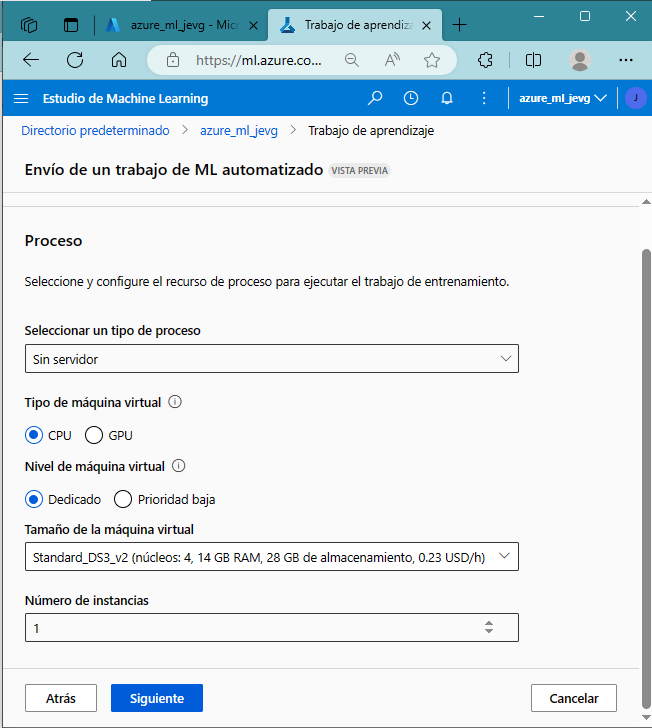
 <em><strong>Computation and virtual machine settings.</strong></em> 

Submit the training job. It starts automatically.

Wait for the job to finish. It may take a while, now might be a good time to have a coffee!

            
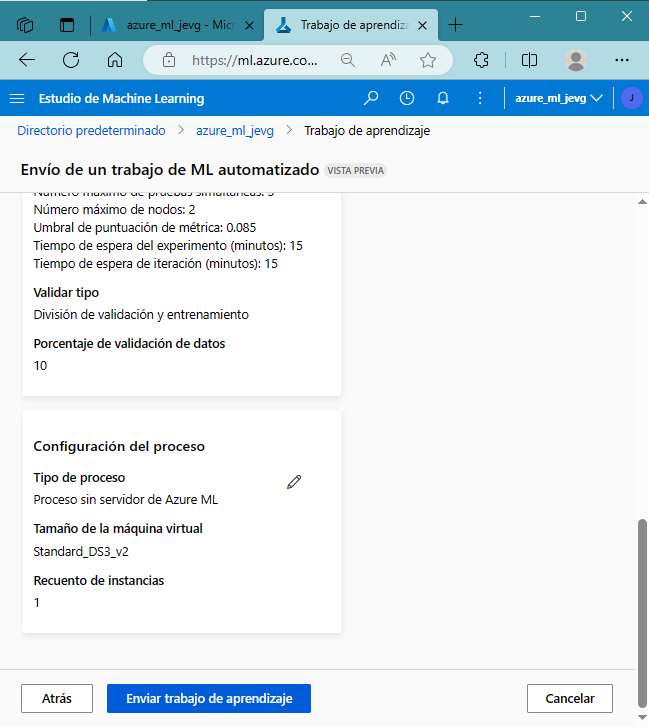
 <em><strong>Job submission confirmation.</strong></em> 

### Check the best model

            

 <em><strong>It isnt finish.</strong></em> 

Once the automated machine learning job is finished, you can review the best model you have trained.

In the Automated Machine Learning Job Overview tab, note the best model summary. Screenshot of the best model summary from the automated machine learning job with a box around the algorithm name.

**Note** You may see a message in the status "Warning: User specified output score has been reached...". This is an expected message. Proceed to the next step.

Select the text in Algorithm name to see the best model to view its details.

Select the Metrics tab and select the residuals and predicted_true graphs if they are not already selected.

Review the graphs that show the performance of the model. The residuals plot shows the residual values (the differences between the predicted and actual values) as a histogram. The predicted_true plot compares the predicted values with the actual values.

**NOTE:** Once you are done, you can delete the content security resource from the Azure Portal. Removing the resource is one way to reduce the costs that accrue when the resource exists in the subscription. To do this, go to the Content Security Resource Overview page. Select Delete at the top of the screen.

  
🌟 Did you find any repository useful?

  If any project has been helpful to you, consider giving it a ⭐ star in the repository and follow my GitHub account to stay tuned for future updates! 🚀

  In addition, I am always open to suggestions, recommendations or collaborations. Feel free to [get in touch](https://www.linkedin.com/in/vazquez-galan-jose-emmanuel-664968221) if you have any questions or ideas for improving this project. I'm excited for your feedback and contributions.

  Thank you for your interest and support! 😊

 This work is licensed under a <a rel="license" href="http://creativecommons.org/licenses/by-nc-sa/4.0/">Creative Commons Attribution-NonCommercial-ShareAlike 4.0 International License</a>.

