# Explore Azure OpenAI

Azure OpenAI Service brings the generative AI models developed by OpenAI to the Azure platform, enabling you to develop powerful AI solutions that benefit from the security, scalability, and integration of services provided by the Azure cloud platform.

In this exercise, you’ll explore Azure OpenAI Service and use it to deploy and experiment with generative AI models.

**Estimated Time:** This exercise will take approximately 25 minutes.

## Before You Start

You will need an Azure subscription that has been approved for access to the Azure OpenAI service for both text and code models, and DALL-E image generation models.

- To sign up for a free Azure subscription, visit [Azure Free Tier](https://azure.microsoft.com/free).
- To request access to the Azure OpenAI service, visit [Azure OpenAI Access Request](https://aka.ms/oaiapply).

## Provision an Azure OpenAI Resource

Before you can use Azure OpenAI models, you must provision an Azure OpenAI resource in your Azure subscription.

1. Sign into the [Azure portal](https://portal.azure.com).
2. Create an Azure OpenAI resource with the following settings:
   - **Subscription:** An Azure subscription that has been approved for access to the Azure OpenAI service.
   - **Resource Group:** Choose an existing resource group or create a new one with a name of your choice.
   - **Region:** East US* (Different regions have different availability and quota for models. In this exercise, you’ll be using a GPT-35-Turbo model for text generation and a DALL-E model for image generation, both of which are supported in East US.)
   - **Name:** A unique name of your choice.
   - **Pricing Tier:** Standard S0

<p align="center">
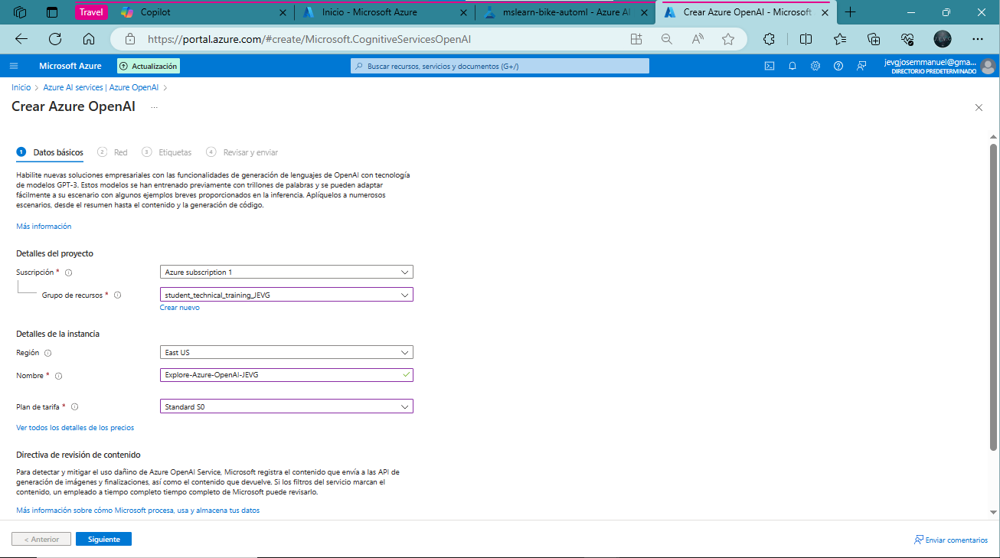
<br><em><strong>Azure OpenAI resource creation.</strong></em><br/>
</p>

Wait for the deployment to complete. Then, go to the deployed Azure OpenAI resource in the Azure portal.

<p align="center">
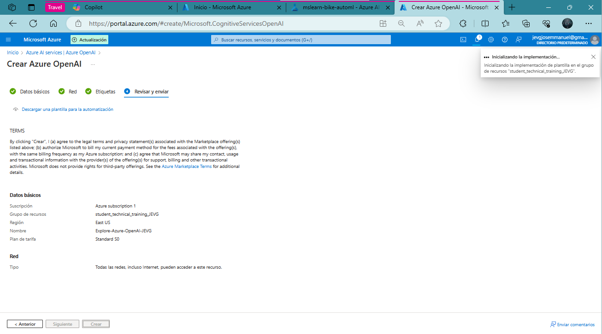
<br><em><strong>Deployment completion screen.</strong></em><br/>
</p>

## Explore Azure OpenAI Studio

You can deploy, manage, and explore models in your Azure OpenAI Service by using Azure OpenAI Studio.

1. On the Overview page for your Azure OpenAI resource, use the **Explore** button to open Azure OpenAI Studio in a new browser tab. Alternatively, navigate directly to [Azure OpenAI Studio](https://studio.openai.azure.com).

When you first open Azure OpenAI Studio, it should look similar to this:

<p align="center">
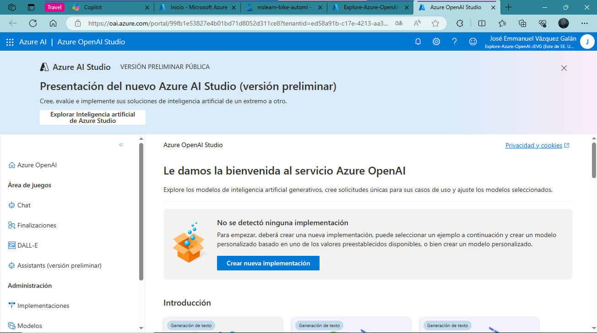
<br><em><strong>Initial view of Azure OpenAI Studio.</strong></em><br/>
</p>

View the pages available in the pane on the left. You can always return to the home page at the top. Additionally, OpenAI Studio provides multiple pages where you can:

- **Experiment with models in a playground:**

<p align="center">
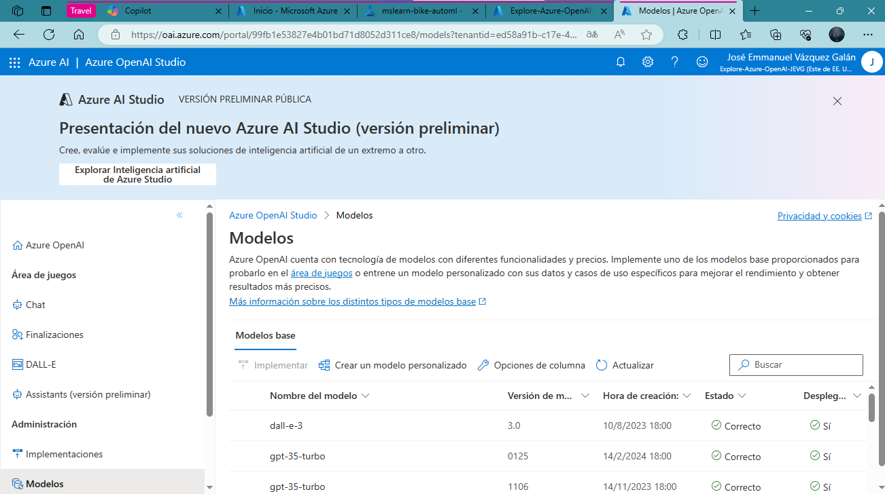
<br><em><strong>Model experimentation playground.</strong></em><br/>
</p>

- **Manage model deployments and data:**

<p align="center">
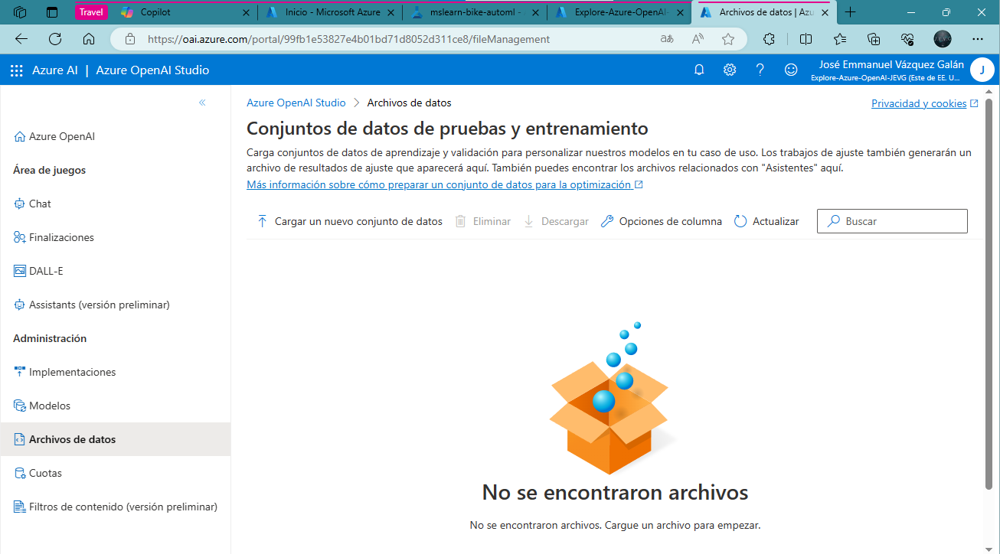
<br><em><strong>Model management and data handling.</strong></em><br/>
</p>


## Deploy a Model for Language Generation

To experiment with natural language generation, you must first deploy a model.

1. On the Models page, view the available models in your Azure OpenAI service instance.
2. Select any of the gpt-35-turbo models for which the Deployable status is "Yes", and then select **Deploy**.

<p align="center">
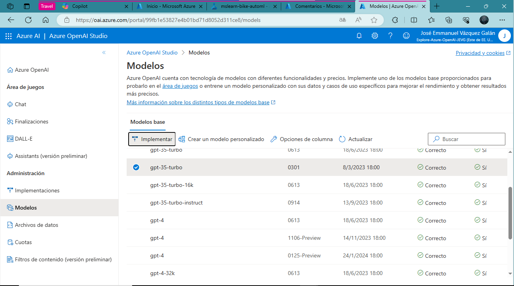
<br><em><strong>Selecting a model for deployment.</strong></em><br/>
</p>

Create a new deployment with the following settings:
- **Model:** gpt-35-turbo
- **Model Version:** Auto-update to default
- **Deployment Name:** A unique name for your model deployment
- **Advanced Options:**
  - **Content Filter:** Default
  - **Deployment Type:** Standard
  - **Tokens per Minute Rate Limit:** 5K* (A rate limit of 5,000 tokens per minute is more than adequate to complete this exercise while leaving capacity for other people using the same subscription.)
  - **Enable Dynamic Quota:** Enabled

<p align="center">
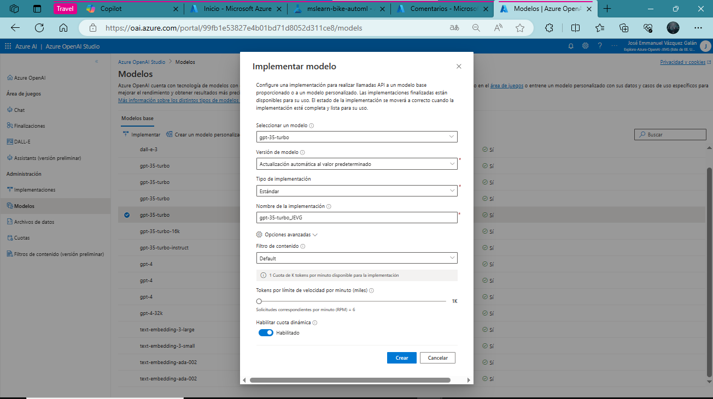
<br><em><strong>Deployment configuration settings.</strong></em><br/>
</p>

### Use the Chat Playground to Work with the Model

Now that you have deployed a model, you can use it in the Chat playground to generate natural language output from prompts that you submit in a chat interface.

In Azure OpenAI Studio, navigate to the Chat playground in the left pane.

The Chat playground provides a chatbot interface with which you can interact with your deployed model, as shown here:

<p align="center">
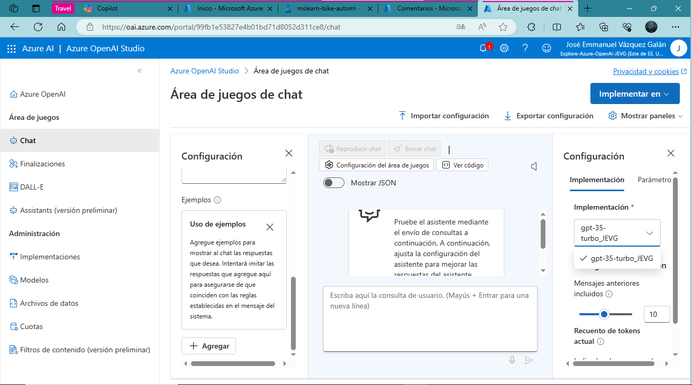
<br><em><strong>Chat playground interface.</strong></em><br/>
</p>

In the Configuration pane, ensure that your model deployment is selected.

<p align="center">
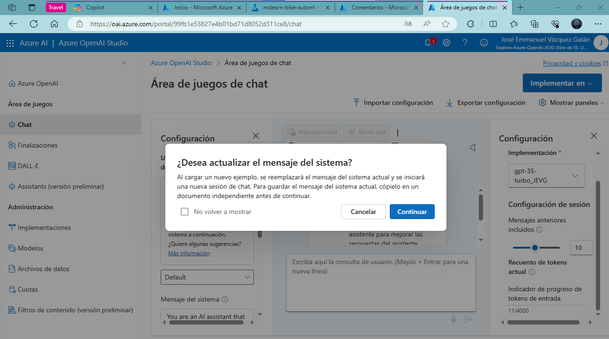
<br><em><strong>Assistant setup configuration.</strong></em><br/>
</p>


Enter the following user message:
```markdown
What is generative AI?
```
Observe the output returned by the model, which should provide a definition of generative AI.

<p align="center">
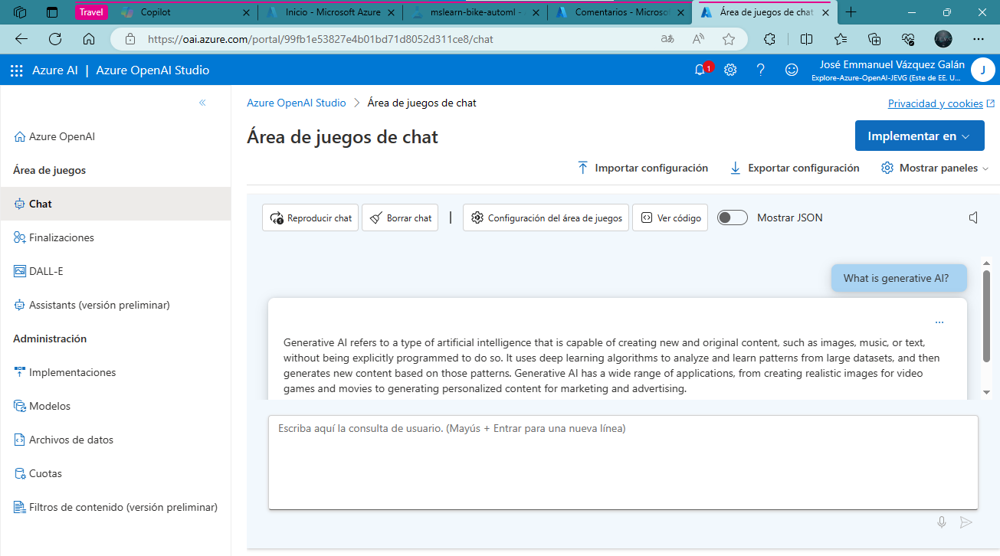
<br><em><strong>Response from the model on what generative AI is.</strong></em><br/>
</p>

Enter the following user message as a follow-up question:

```markdown
What are three benefits it provides?
```

Review the output, noting that the chat session has kept track of the previous input and response to provide context (so it correctly interprets “it” as referring to “generative AI”) and that it provides a suitable response based on what was requested (it should return three benefits of generative AI).

<p align="center">
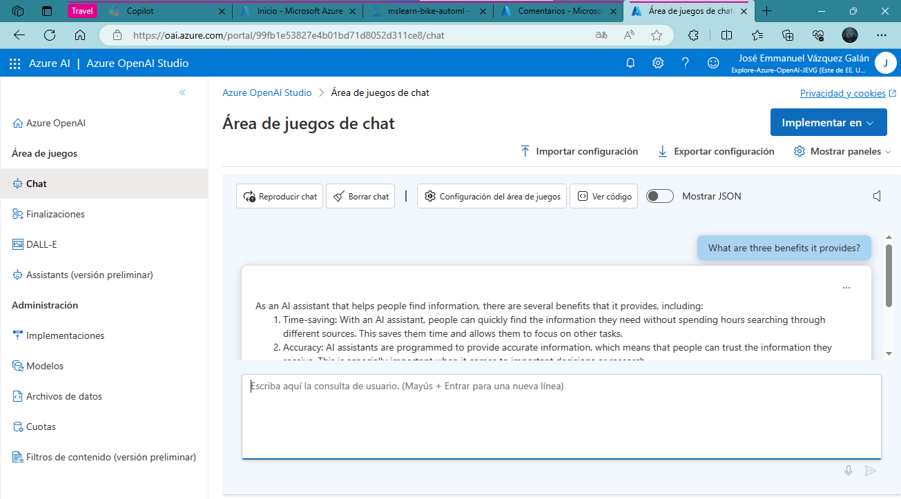
<br><em><strong>Model response detailing three benefits of generative AI.</strong></em><br/>
</p>

### Use the DALL-E Playground to Generate Images

In addition to language generation models, Azure OpenAI Service supports the DALL-E 2 / Dalle3 model for image generation.

**Note:** You must have applied for and received access to DALL-E functionality in your Azure OpenAI service access application to complete this section of the exercise.

In Azure OpenAI Studio, navigate to the DALL-E playground in the left pane.

<p align="center">
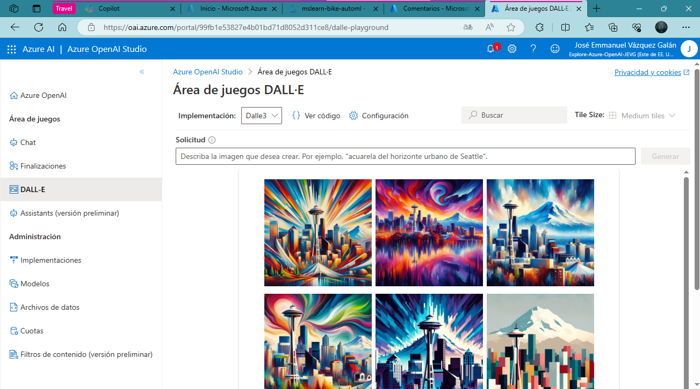
<br><em><strong>Navigation to DALL-E playground.</strong></em><br/>
</p>
Enter the following prompt:

```markdown
A robot eating spaghetti
```

Select Generate and view the results, which should consist of an image based on the description you provided in the prompt, similar to this:

<p align="center">
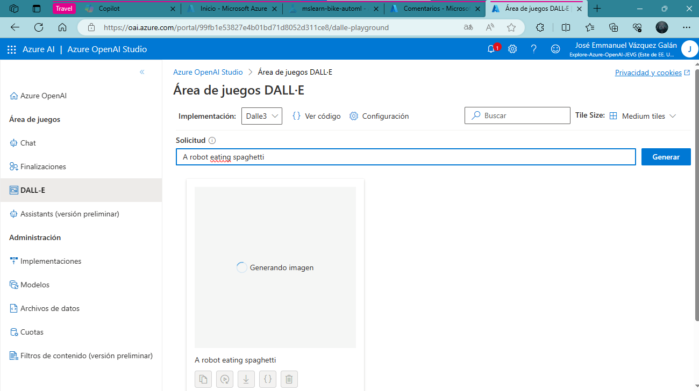
<br><em><strong>First generated image of a robot eating spaghetti.</strong></em><br/>
</p>
<p align="center">
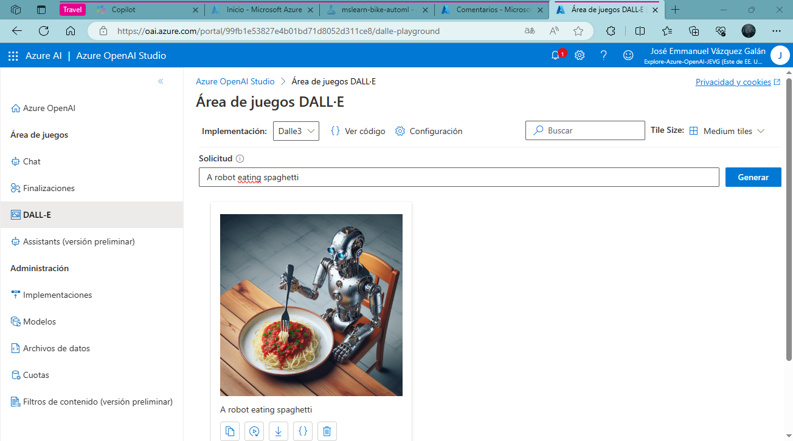
<br><em><strong>Second generated image of a robot eating spaghetti.</strong></em><br/>
</p>


Generate a second image by modifying the prompt to:

```markdown
A robot eating spaghetti in the style of Rembrandt
```

Verify that the new image matches the requirements of the prompt, similar to this:

<p align="center">
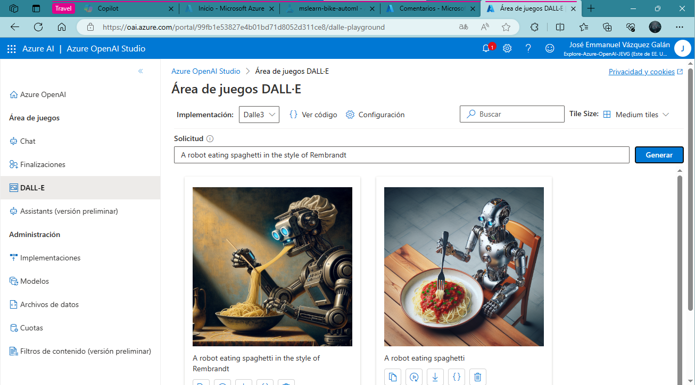
<br><em><strong>Robot eating spaghetti in the style of Rembrandt.</strong></em><br/>
</p>


## Clean up
When you’re done with your Azure OpenAI resource, remember to delete the deployment or the entire resource in the **Azure portal.**

<details>
  <summary>🌟 Did you find any repository useful?</summary>
  If any project has been helpful to you, consider giving it a ⭐ star in the repository and follow my GitHub account to stay tuned for future updates! 🚀

  In addition, I am always open to suggestions, recommendations or collaborations. Feel free to [get in touch](https://www.linkedin.com/in/vazquez-galan-jose-emmanuel-664968221) if you have any questions or ideas for improving this project. I'm excited for your feedback and contributions.

  Thank you for your interest and support! 😊
</details>


<p align="center">
<a rel="license" href="http://creativecommons.org/licenses/by-nc-sa/4.0/"></a><br />This work is licensed under a <a rel="license" href="http://creativecommons.org/licenses/by-nc-sa/4.0/">Creative Commons Attribution-NonCommercial-ShareAlike 4.0 International License</a>.
</p>
