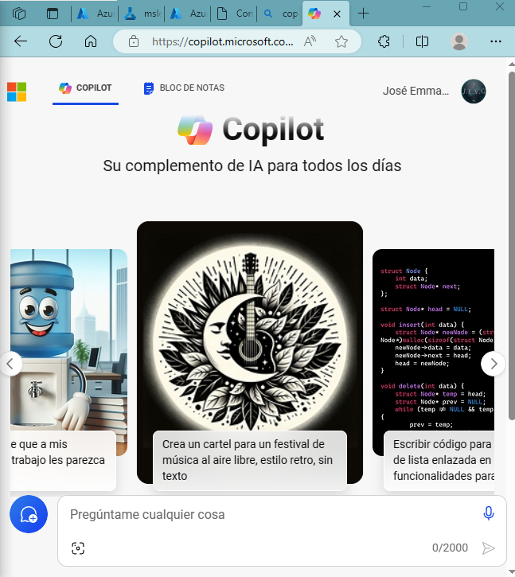
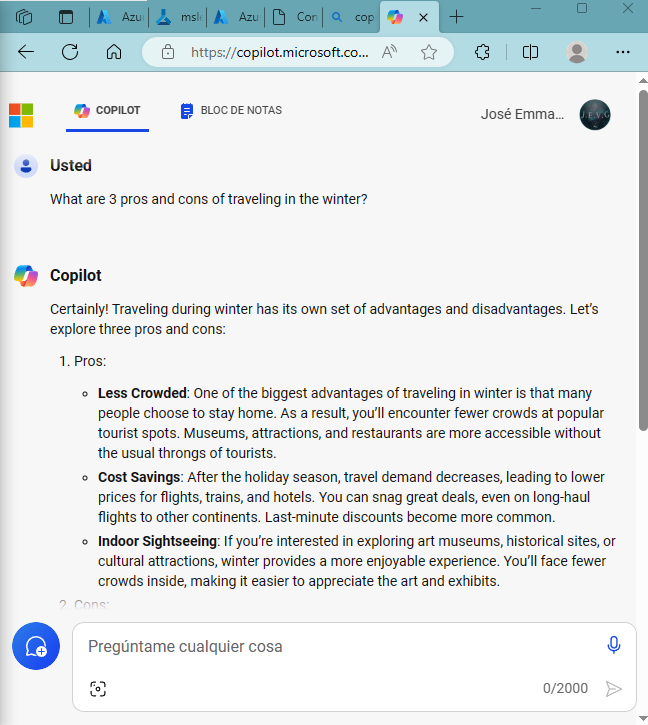
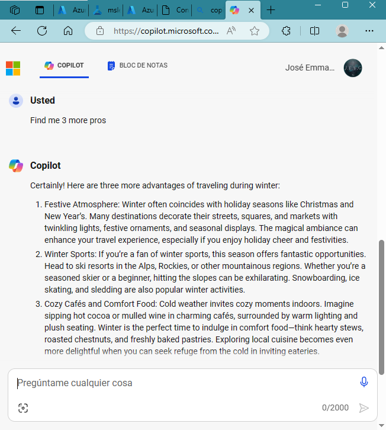
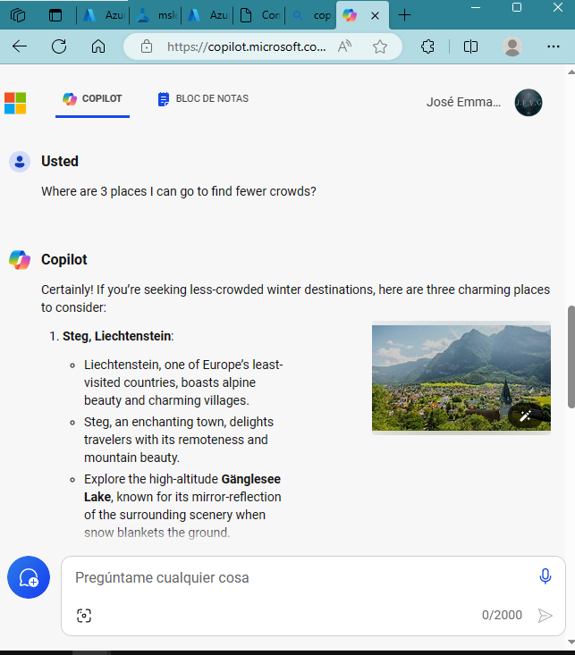
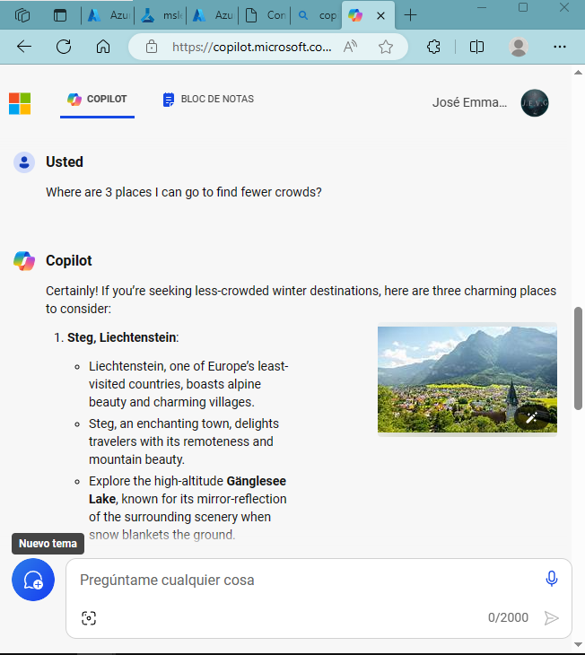
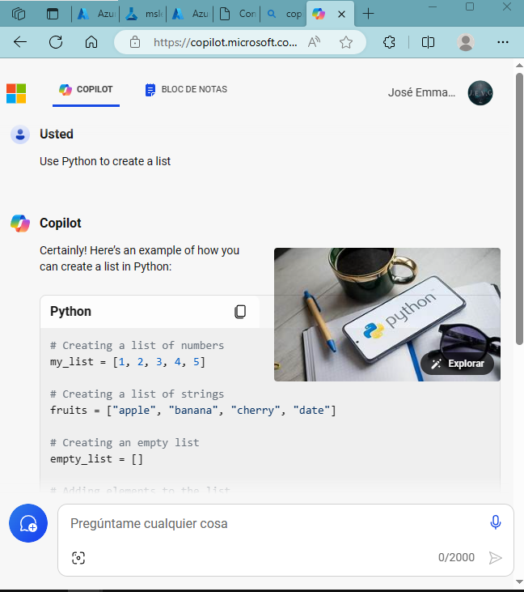
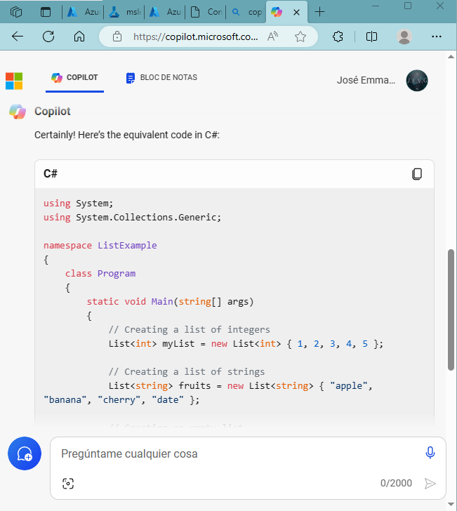
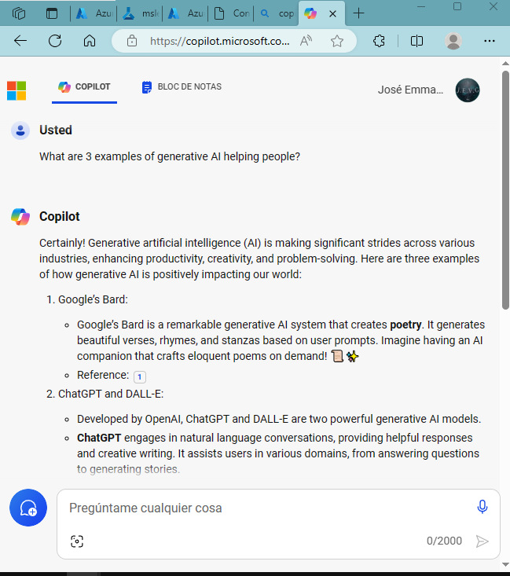
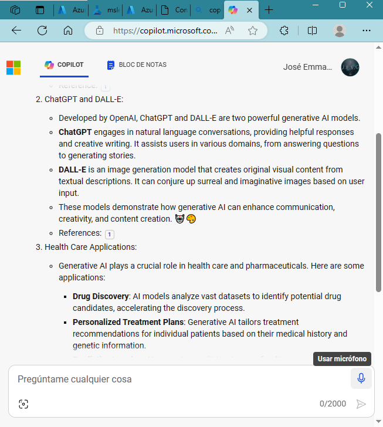

# Explore Generative AI with Microsoft Copilot

Sign in to Microsoft Copilot

Open Microsoft Copilot at and sign in with your personal Microsoft account. [https://copilot.microsoft.com](https://copilot.microsoft.com)

Microsoft Copilot uses generative AI to improve Bing search results. What this means is that unlike search alone, which returns existing content, Microsoft Copilot can create new answers based on natural language modeling and information from the Web.

Towards the bottom of the screen, you will see an *Ask Me Anything* window. As you enter messages into the window, Copilot uses the entire conversation thread to return answers. For example, let's try asking a series of questions about travel.

<p align="center">            

<br >
    <strong><em>    
Image of Microsoft Copilot's interface showing travel questions.
    </em></strong>
<br />
</p>

## Use messages to generate responses

Type a message: `What are 3 pros and cons of traveling in the winter?`. You will see *Searching:...* and *Generating...* appear before the answer. The model uses the searched answers as grounding information to generate original answers. Note that the end of the answer contains links to your sources.

<p align="center">            

<br >
<strong><em> 
Screenshot showing pros and cons of traveling in winter.
</em></strong>
<br />
</p>

Note: If you do not see a *Generating...* message or a bulleted list response, you have not yet been able to see Copilot in action. You must go back to the login menu and connect the current account you are using with a personal account.

Type a message: `Find me 3 more pros`.

<p align="center">            

<br >
    <em><strong>
Additional pros for traveling in winter displayed by Copilot.
    </em></strong>
<br />
</p>

Type a message: `Where are 3 places I can go to find fewer crowds?`

<p align="center">            

<br >
    <em><strong>
Copilot's suggestions for places with fewer crowds.
    </em></strong>
<br />
</p>

Note: Please note that while Copilot may give a related response, it may remove previous "memories" from the thread as it continues. This largely has to do with token input limitations.

<p align="center">            

<br >
    <em><strong>
First part of the interface for new topics in Microsoft Copilot.
    </em></strong>
<br />
</p>

<p align="center">            

<br >
    <em><strong>
Second part of the interface showing new topic creation.
    </em></strong>
<br />
</p>

## Test image generation

Now let's see an example of image generation. Type a message: `Create an image of an elephant eating a hamburger`.

<p align="center">            

<br >
    <em><strong>
Generated image of an elephant eating a hamburger.
    </em></strong>
<br />
</p>

Note: Your images may not be identical to those shown here.

<p align="center">            

<br >
    <em><strong>
DALL-E powered image generation example.<br />
    </em></strong>
</p>

## Test code generation

Now let's look at an example of code generation and translation. Type a message: `Use Python to create a list`.

<p align="center">            

<br >
    <em><strong>
Example of code generation in Python for creating lists.
    </em></strong>
<br />
</p>

```python
# Creating a list of numbers
my_list = [1, 2, 3, 4, 5]

# Creating a list of strings
fruits = ["apple", "banana", "cherry", "date"]

# Creating an empty list
empty_list = []

# Adding elements to the list
empty_list.append("grape")
empty_list.append("kiwi")

# Accessing elements in the list
print("First fruit:", fruits[0])
print("Second number:", my_list[1])

# Iterating through the list
for fruit in fruits:
    print("Fruit:", fruit)

# Length of the list
print("Number of fruits:", len(fruits))

Type the message: `Translate that into C#.`


<p align="center">            

<br >
    <em><strong>
Example of code translation into C#.
    </em></strong>
<br />
</p>

```C#
using System;
using System.Collections.Generic;

namespace ListExample
{
    class Program
    {
        static void Main(string[] args)
        {
            // Creating a list of integers
            List<int> myList = new List<int> { 1, 2, 3, 4, 5 };

            // Creating a list of strings
            List<string> fruits = new List<string> { "apple", "banana", "cherry", "date" };

            // Creating an empty list
            List<string> emptyList = new List<string>();

            // Adding elements to the list
            emptyList.Add("grape");
            emptyList.Add("kiwi");

            // Accessing elements in the list
            Console.WriteLine("First fruit: " + fruits[0]);
            Console.WriteLine("Second number: " + myList[1]);

            // Iterating through the list
            foreach (string fruit in fruits)
            {
                Console.WriteLine("Fruit: " + fruit);
            }

            // Length of the list
            Console.WriteLine("Number of fruits: " + fruits.Count);
        }
    }
}
```

## Bonus task

Write a message: `What are 3 examples of generative AI helping people?`

<p align="center">            

<br >
First example of generative AI assisting individuals.<br />
</p>
<p align="center">            

<br >
<em><strong>
Second example of generative AI application.</em></strong>
<br />
</p>
```
