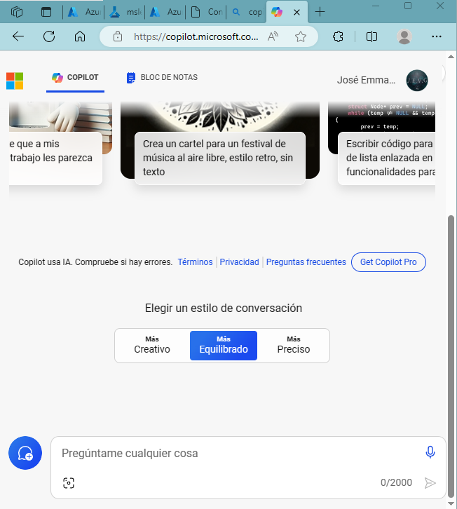

# Explora la IA generativa con Microsoft Copilot

Iniciar sesión en Microsoft Copilot
Abra Microsoft Copilot en e inicie sesión con su cuenta personal de Microsoft.https://copilot.microsoft.com

Microsoft Copilot usa IA generativa para mejorar los resultados de búsqueda de Bing. Lo que esto significa es que, a diferencia de la búsqueda sola, que devuelve contenido existente, Microsoft Copilot puede crear nuevas respuestas basadas en el modelado del lenguaje natural y la información de la web.

Hacia la parte inferior de la pantalla, verás una ventana Pregúntame lo que quieras. A medida que introduce mensajes en la ventana, Copilot utiliza todo el hilo de conversación para devolver las respuestas. Por ejemplo, intentemos hacer una serie de preguntas sobre los viajes.

## Usar mensajes para generar respuestas
Escriba un mensaje: . Verá que aparecen Buscando:... y Generando... antes de la respuesta. El modelo utiliza las respuestas buscadas como información de conexión a tierra para generar respuestas originales. Observe que el final de la respuesta contiene enlaces a sus fuentes.

What are 3 pros and cons of traveling in the winter?

Nota: Si no ve un mensaje *Generando... o una respuesta de lista de viñetas, aún no ha podido ver Copilot en acción. Debe volver al menú de inicio de sesión y conectar la cuenta actual que está utilizando con una cuenta personal.

Escriba un mensaje: . Lo que quiere decir con este mensaje es que le gustaría ver 3 razones positivas más para viajar en invierno que aún no se han enumerado. Tenga en cuenta que, con este mensaje, le pide a Copilot que haga dos cosas que la búsqueda por sí sola no hace: usar la respuesta del chat anterior para excluir lo que se devuelve en la nueva respuesta y usar el tema del chat anterior sin indicarlo explícitamente.

Find me 3 more pros

Escriba un mensaje: 

Where are 3 places I can go to find fewer crowds?

Nota: Tenga en cuenta que, si bien Copilot puede dar una respuesta relacionada, puede eliminar "recuerdos" anteriores del hilo de conversación a medida que continúa. Como resultado, es posible que las respuestas que obtenga no estén directamente relacionadas con viajar en invierno. Esto tiene que ver en gran medida con las limitaciones de entrada de tokens. Cuando el chat "recuerda" partes anteriores de una conversación, es porque ha guardado una cierta cantidad de tokens de la conversación. A medida que se introduzcan nuevos tokens a través de sus nuevas indicaciones y respuestas, el chat dejará de lado los tokens más antiguos.

El botón Nuevo tema junto a la ventana de chat es útil. Al hacer clic en él, se borra el hilo de conversación anterior para que las respuestas del nuevo tema no se basen en el tema anterior. Utilice el icono Nuevo tema junto a la ventana de chat para borrar el historial de mensajes.

Pruebe la generación de imágenes
Ahora veamos un ejemplo de generación de imágenes. Escriba un mensaje: . Observe que aparece un mensaje que intentaré crear y que... aparece antes de que Copilot devuelva una respuesta.Create an image of an elephant eating a hamburger

Nota: Es posible que sus imágenes no sean idénticas a las que se muestran aquí.

En la respuesta, hay un texto en la parte inferior que dice "Desarrollado por DALL-E". DALL-E es un modelo de lenguaje grande que genera imágenes a partir de la entrada de lenguaje natural.

Pruebe la generación de código
Ahora veamos un ejemplo de generación y traducción de código. Escriba un mensaje: .Use Python to create a list

''' code
# Creating a list of numbers
my_list = [1, 2, 3, 4, 5]

# Creating a list of strings
fruits = ["apple", "banana", "cherry", "date"]

# Creating an empty list
empty_list = []

# Adding elements to the list
empty_list.append("grape")
empty_list.append("kiwi")

# Accessing elements in the list
print("First fruit:", fruits[0])
print("Second number:", my_list[1])

# Iterating through the list
for fruit in fruits:
    print("Fruit:", fruit)

# Length of the list
print("Number of fruits:", len(fruits))
'''code

Escriba el mensaje: . Observe que no es necesario especificar qué es "eso", ya que Copilot sabe que debe hacer referencia al historial de conversaciones.Translate that into C#

'''code
using System;
using System.Collections.Generic;

namespace ListExample
{
    class Program
    {
        static void Main(string[] args)
        {
            // Creating a list of integers
            List<int> myList = new List<int> { 1, 2, 3, 4, 5 };

            // Creating a list of strings
            List<string> fruits = new List<string> { "apple", "banana", "cherry", "date" };

            // Creating an empty list
            List<string> emptyList = new List<string>();

            // Adding elements to the list
            emptyList.Add("grape");
            emptyList.Add("kiwi");

            // Accessing elements in the list
            Console.WriteLine("First fruit: " + fruits[0]);
            Console.WriteLine("Second number: " + myList[1]);

            // Iterating through the list
            foreach (string fruit in fruits)
            {
                Console.WriteLine("Fruit: " + fruit);
            }

            // Length of the list
            Console.WriteLine("Number of fruits: " + fruits.Count);
        }
    }
}

'''code

Tarea de bonificación
Escriba un mensaje: . ¡Puedes usar esto como una forma de hacer una lluvia de ideas sobre tus propias ideas de copiloto!What are 3 examples of generative AI helping people?

